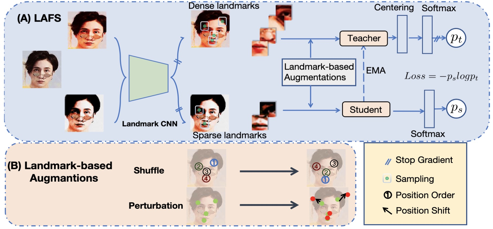

## **LAFS: Landmark-based Facial Self-supervised Learning for Face Recognition**


<!---
<p align="center">
    
</p> 
-->
<!--- 添加一下main图片，我没找到png版本的大图-->

This is the official PyTorch implementation of CVPR 2024 paper  ([LAFS: Landmark-based Facial Self-supervised Learning for Face Recognition](https://arxiv.org/abs/2403.08161)).

Our code is partly borrowed from DINO (https://github.com/facebookresearch/dino) and Insightface(https://github.com/deepinsight/insightface).

### Abstract
In this work we focus on learning facial representations that can be adapted to train effective face recognition models, particularly in the absence of labels. Firstly, compared with existing labelled face datasets, a vastly larger magnitude of unlabeled faces exists in the real world. We explore the learning strategy of these unlabeled facial images through self-supervised pretraining to transfer generalized face recognition performance. Moreover, motivated by one recent finding, that is, the face saliency area is critical for face recognition, in contrast to utilizing random cropped blocks of images for constructing augmentations in pretraining, we utilizcd e patches localized by extracted facial landmarks. This enables our method - namely Landmark-based Facial Self-supervised learning (LAFS), to learn key representation that is more critical for face recognition. We also incorporate two landmark-specific augmentations which introduce more diversity of landmark information to further regularize the learning. With learned landmark-based facial representations, we further adapt the representation for face recognition with regularization mitigating variations in landmark positions. Our method achieves significant improvement over the state-of-the-art on multiple face recognition benchmarks, especially on more challenging few-shot scenarios.

```bibtex
@InProceedings{Sun_2024_CVPR,
    author    = {Sun, Zhonglin and Feng, Chen and Patras, Ioannis and Tzimiropoulos, Georgios},
    title     = {LAFS: Landmark-based Facial Self-supervised Learning for Face Recognition},
    booktitle = {Proceedings of the IEEE/CVF Conference on Computer Vision and Pattern Recognition (CVPR)},
    month     = {June},
    year      = {2024}
}
```
Please consider ***cite our paper and star the repo*** if you find this repo useful.


## To Do

- [x] LAFS Pretraining scripts
- [ ] DINO-face Pretraining scripts
- [x] Checkpoints
- [x] Finetuning scripts
- [x] IJB datasets evaluation code

Please stay tuned for more updates.
### Usage
1. **Pytorch Version**
```
torch==1.8.1+cu111;  torchvision==0.9.1+cu111
```
2. **Dataset**

- [x] MS1MV3    -- Please download from InsightFace(https://github.com/deepinsight/insightface/tree/master/recognition/_datasets_). Note that MS1MV3 use bgr order, and WebFace4M use rgb order.
- [x] WebFace4m  --I can't release the .rec file of this whole dataset as there is license issue. Please obtain from the offical website(https://www.face-benchmark.org/download.html) and convert into .ref file using ima2rec.py.

- [x] Few-shot WebFace4m:  To ensure that the experiments are reproducible, the few-shot WebFace4M datasets filtered by me are released as follows:

|1-shot| 2-shot| 4-shot | 10-shot|full|
|---|---|---|---|---|
|[link](https://1drv.ms/u/c/7bd58491c54e4351/EWEv9Aw72klBpYfYLNJMII8BGvGuoIXeVV5OutzKbOn3dA?e=ofxekc) |[link](https://1drv.ms/u/c/7bd58491c54e4351/EeVKM5eAu2hJvXle4cxjLkABHwZEGjTAK4S3Lt7KfsFi8w?e=tKrcBE) |[link](https://1drv.ms/u/c/7bd58491c54e4351/ESDN7Xq-cdBAmTNcQokuoekB093IxDhjZ3WCMMkr6Gq3ZA?e=cHWVA3) | [link](https://1drv.ms/u/c/7bd58491c54e4351/ET0ml8yWbWlAptv5LgjNXfoBlX4ru7A4fpE6z7vH2eA-JA?e=4W52Is) |please use the original WebFace4M|

Please specify the ratio for experiment in FaceDataset function. For example, 1% with 1-shot, you should set **partition** in **FaceDataset** to 0.01.

3. **SSL Pretraining Command:**

Before you start self-supervised pretraining, please use the landmark weight trained on MS1MV3 or WebFace4M, and specify in **--landmark_path**:

- [x] [Part-fViT MS1MV3](https://drive.google.com/file/d/1ev-y0aOmt1mhQCCZwh3ef204ibszi1Rl/view?usp=sharing) (Performance on IJB-C: TAR@FAR=1e-4 97.29).
- [x] [Part-fViT WebFace4M](https://drive.google.com/file/d/16fsYE-j4v6dh7V-_aM0nnU9VdjjlZ1VX/view?usp=drive_link) (Performance on IJB-C: TAR@FAR=1e-4 97.40)

```
python -m torch.distributed.launch --nproc_per_node=2 lafs_train.py
```
Note on 2A100 (40GB), the total pretraining training time would be around 2-3 days. 

4. **Supervised finetuning Command:**

The training setting difference between the MS1MV3 and WebFace4M is that MS1MV3 use a stronger mixup probability of 0.2 and rand augmentation with magnitude of 2, while WebFace4M use 0.1 for mixup and rand augmentation magnitude. 

&emsp;And please note the colour channel of these datasets, i.e. MS1MV3 use brg order.

&emsp;Before you run the following command, please change the dataset path **--dataset_path**, SSL pretrained model **--model_dir**, and model from stage 1 **--pretrain_path**.

&emsp;If you want to run the model with flip augmentation only, please disable the mixup and augmentations, by setting random_resizecrop, rand_au to False in the FaceDataset function, and set mixup-prob to 0.0


```
python -m torch.distributed.launch --nproc_per_node=2 --nnodes=1 --node_rank=0  --master_port 47771 train_largescale.py
```


&emsp;Please let me know if there is any problem in using this code as the cleaned code hasn't been tested. I will keep updating the usage of the code, thank you!

### Evaluation
```
python IJB_evaluation.py
```
Please specify the model_path and image_path in the file. You can download the data from [Insightface](https://drive.google.com/file/d/1aC4zf2Bn0xCVH_ZtEuQipR2JvRb1bf8o/view?usp=sharing)
### Supervised Checkpoints
|Training set   | pretrained|Model  | IJB-B| IJB-C|
|---            | ---       | ---   | ---        |---|
|WebFace4M      | No        | [Part fViT](https://drive.google.com/file/d/16fsYE-j4v6dh7V-_aM0nnU9VdjjlZ1VX/view?usp=drive_link)      | 96.05| 97.40|
|WebFace4M      | LAFS      | [Part fViT](https://drive.google.com/file/d/1BUYm2Bcgp8ZRlBcwOZxiJtWiQAvK2Ujy/view?usp=drive_link)|   IJB-B: 96.28| 97.58|

### Self-supervised Checkpoints
|Pretraining Set   | SSL Method|Model  |
|---             | ---       | ---   |
|1-shot WebFace4M      | DINO        | [fViT](https://drive.google.com/file/d/19hbQYNnMvJ5enKlxOQnb5QSCefL6MTuA/view?usp=drive_link)      |
|1-shot WebFace4M      | LAFS      | [Part fViT](https://drive.google.com/file/d/1WykUT8MRBbc8Oc-WjQ_aya2ubfLPMgae/view?usp=drive_link)|   
|---             | ---      | ---   |
|MS1MV3          | LAFS      | ---   | 
### License
This project is licensed under the terms of the MIT license.
